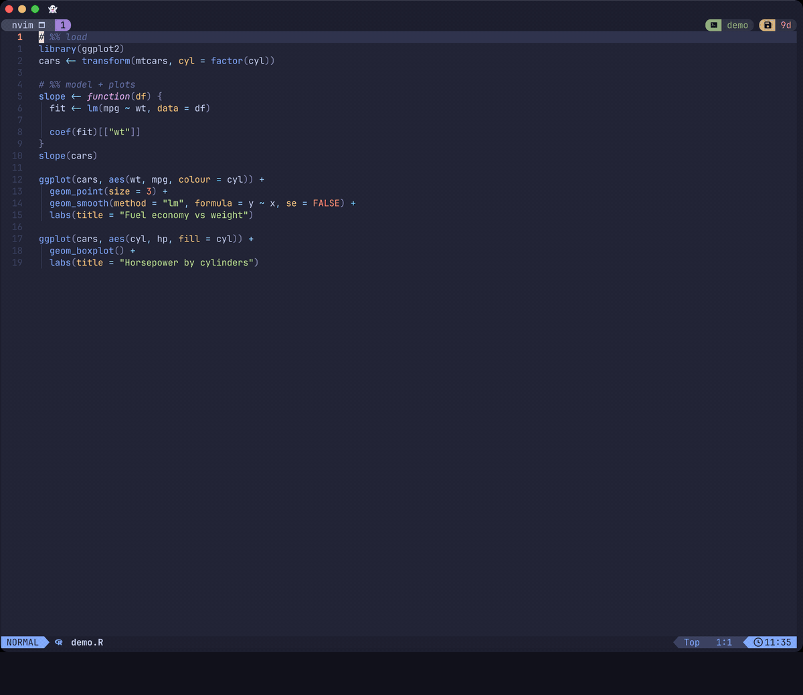

# replstudio.nvim

An R and Python REPL with a live plot pane, inside Neovim. It works like RStudio or Positron, but stays minimal.



<sub>Ghostty + tmux, LazyVim. [Watch the higher-quality MP4](assets/demo.mp4). The demo scripts are in [`assets/demo/`](assets/demo).</sub>

- **`<Enter>` sends the statement under the cursor**, as in R.nvim. Treesitter picks out whole functions, loops, `if/else`, pipe chains and ggplot `+` chains. The cursor then moves to the next statement.
- **Plots show up in a side pane** as soon as they are drawn. Supported: ggplot2 and base graphics in R, matplotlib and plotnine in Python. They are drawn with Ghostty/kitty graphics through `Snacks.image`, and work inside tmux.
- **The interpreter is detected automatically.**
  - R uses `radian` if installed, otherwise `R`.
  - Python uses the project's `.venv`/`venv` (IPython if present). Otherwise it falls back to a managed venv at `~/.local/share/replstudio/venv`, which is created after asking.
- **Parquet files open as a table.** `:e data.parquet` shows the first 200 rows with column types, read-only, through the `duckdb` CLI.
- **Snappy by design.**
  - Startup cost is zero (lazy on filetype).
  - Nothing polls: plots arrive through `fs_event`.
  - Picking the statement takes about 0.05 ms.
  - A parquet file opens in about 40 ms, whatever its size.
  - The interpreter hooks cost about 2–6 µs per command in Python and about 0.08 ms in R.

## Requirements

- Neovim ≥ 0.11
- [snacks.nvim](https://github.com/folke/snacks.nvim) to draw plots. It ships with LazyVim. `image` does not need to be enabled.
- A terminal with the kitty graphics protocol (Ghostty, kitty, WezTerm). Under tmux, also set `set -g allow-passthrough on`.
- Treesitter parsers for `r` and `python`
- R: no packages required. The hook picks the first PNG device that works:
  - `ragg` if installed (recommended, best text rendering)
  - otherwise the native `quartz` device on macOS
  - then `cairo` (on macOS, CRAN R's cairo needs XQuartz)
  - then R's default

  Set `REPLSTUDIO_R_DEVICE=ragg|quartz|cairo|default` to force one. If it fails to open, the hook detects again.
- Parquet viewer (optional): the [`duckdb`](https://duckdb.org) CLI, e.g. `brew install duckdb`.

## Install (lazy.nvim)

```lua
{
  "matthewgson/replstudio.nvim", -- or dir = "~/path/to/09_ReplStudio"
  ft = { "r", "python", "quarto" },
  cmd = "ReplStudio",
  event = "BufReadCmd *.parquet", -- the parquet viewer
  opts = {},
}
```

On LazyVim with the `lang.r` extra, also add `{ "R-nvim/R.nvim", enabled = false }`. This frees `<Enter>` in R buffers.

## Keys

All keys are buffer-local in `r`, `python` and `quarto` buffers, and all of them show up in which-key. The group lives under `<leader>i` (interpreter). `<leader>r` is left free for [quarto-render.nvim](https://github.com/matthewgson/quarto-render.nvim), so the two coexist in `.qmd` files.

| Key | Action |
|---|---|
| `<Enter>` (normal) | Send the statement and advance |
| `<Enter>` (visual) | Send the selection |
| `<S-Enter>` | Send the `# %%` cell or Quarto chunk and jump to the next one |
| `<leader>ir` | Toggle the REPL (starts it) |
| `<leader>io` | Browse REPL output: scroll, search, yank (`q` goes back) |
| `<leader>ip` | Toggle the plot pane |
| `<leader>il` | Cycle the layout: studio → side → focus |
| `<leader>is` | Source the file |
| `<leader>ic` | Send the cell |
| `<leader>ii` | Interrupt |
| `<leader>ix` | Clear |
| `<leader>iR` | Restart |
| `<leader>iq` | Quit |
| `<leader>iz` | Zoom the plot |
| `<leader>iv` | Interpreter info |
| `[p` / `]p` | Previous / next plot |

**Scrolling the REPL:**
- **Mouse wheel:** scroll over the REPL pane. This works even while the cursor stays in your script.
- **Keyboard:** `<leader>io` moves into the REPL in normal mode at the newest output.
  - Use `<C-u>`/`<C-d>`, `gg`/`G`, `/search` and `y` as usual.
  - `q` goes back to the script, and `i` types into the REPL.

The next statement you send snaps the REPL back to the bottom.

**Plot history:** every plot drawn in this Neovim session is kept, from both R and Python. It survives REPL restarts and is deleted when Neovim exits. Browse it with `[p` / `]p` from the script, or `h` / `l` in the pane. The pane title shows `plot 3/7  R`.

**Python cells** are sent one statement at a time. Python only displays the last expression of a pasted block, so this is what makes every plot in a cell show up, as in R.

In the plot pane:

| Key | Action |
|---|---|
| `h` / `l` | Previous / next plot |
| `o` | Open externally |
| `y` | Copy the path |
| `s` | Save as… |
| `d` | Delete |
| `z` | Zoom |
| `q` | Hide |

Some terminals send Shift+Enter as a plain Enter. Inside tmux, check with `i<C-v><S-CR>`. If that's the case, use `<leader>ic`, or set `extended-keys-format csi-u` in tmux.

## Parquet viewer

Opening a `.parquet` file (`:e`, a file explorer, a picker) shows its first rows as an aligned table instead of binary. It is browse-only: the buffer cannot be edited or written.

- **The header stays put.** Column names and their types (coloured by kind: numbers, text, dates, booleans, nested) stay pinned at the top while you scroll down, and follow when you scroll sideways. Row numbers sit in the left margin, so they stay visible too.
- **Columns are capped** at `max_width` cells. Longer values end in `…`; `K` shows the full value. Tabs and newlines inside a value show as `→` and `↵`.
- **The window bar** shows the file, `first 200 of 2,000,000 rows × 11 cols`, and the keys.

| Key | Action |
|---|---|
| `w` / `b`, `<Tab>` / `<S-Tab>` | Next / previous column (scrolls so the whole column shows) |
| `K` | Full value of the cell, with its column and type |
| `q` | Close |

Everything else is plain Neovim: `j`/`k`, `<C-d>`/`<C-u>`, `gg`/`G`, `zl`/`zh`, `0`/`$`, `/search`.

One `duckdb` call per open reads the row count and schema from the file footer and only the first row group(s) for the rows, so the file's size barely matters. Nothing runs after that.

## Quarto: working directory

`quarto render` runs a document's code from the document's own folder. Code you send from a `.qmd` does the same, so relative paths like `read.csv("data.csv")` work whichever directory Neovim was started from (yazi, a parent folder, …).

- The REPL starts in the project root, so `.Rprofile`/renv and the project `.venv` are found. It then changes into the document's folder.
- If the project's `_quarto.yml` sets `execute-dir: project`, it uses the project folder instead, as Quarto does.
- Documents in different folders get their own REPLs, as Quarto renders each document separately. The REPL title shows the folder, e.g. `R · reports/`.
- Set `quarto = { cwd = "root" }` to keep `.qmd` code in the project root like scripts.

## Layouts

```
studio (default)            side                        focus
┌────────────┬──────┐      ┌────────────┬──────┐      ┌───────────────┬──────┐
│ script     │      │      │            │ plots│      │ script        │ plot │
│            │plots │      │ script     ├──────┤      │               │(float│
├────────────┤      │      │            │ REPL │      ├───────────────┴──────┤
│ REPL       │      │      │            │      │      │ REPL                 │
└────────────┴──────┘      └────────────┴──────┘      └──────────────────────┘
```

## Commands

```
:ReplStudio start | stop | restart | info | plots
:ReplStudio layout [studio|side|focus]
:ReplStudio venv [install | add <pkg…> | update | rebuild]
```

## Options (defaults)

```lua
opts = {
  prefix = "<leader>i",          -- false: no <leader> maps
  layout = "studio",
  size = { plots = 0.38, repl = 0.30 },
  float = { width = 0.45, height = 0.55 },
  auto_open_plots = true,
  quarto = { cwd = "file" },     -- "file": .qmd code runs in its folder; "root"
  plot_scale = 1.0,              -- bigger plot text/lines
  parquet = { rows = 200, max_width = 32 },
  r = { cmd = nil },             -- e.g. { "radian" }
  python = {
    cmd = nil,
    venv = "~/.local/share/replstudio/venv",
    packages = { "ipython", "matplotlib", "plotnine", "pandas", "numpy" },
    version = nil,               -- uv venv --python
  },
}
```

## How it works

Each REPL runs in a Neovim terminal. Startup hooks are injected through environment variables, so your own `.Rprofile` and `PYTHONSTARTUP` still run:

- **R:** `R_PROFILE_USER` → `runtime/r/init.R`
- **Python:** `PYTHONSTARTUP` → `runtime/python/replstudio_startup.py`, plus `MPLBACKEND`

After each command, the hook re-renders the current plot if it changed. It writes `NNNN_RRR.png` atomically into a per-session cache directory, at the plot pane's pixel size. Neovim watches that directory and draws the newest file. A new page becomes a new history entry. A change to the same page, like `lines()` or `plt.title()`, replaces it. After a resize or layout switch, the next command re-renders the current plot to fit.

Tests: `nvim --headless -u NONE -i NONE -l tests/run.lua`
